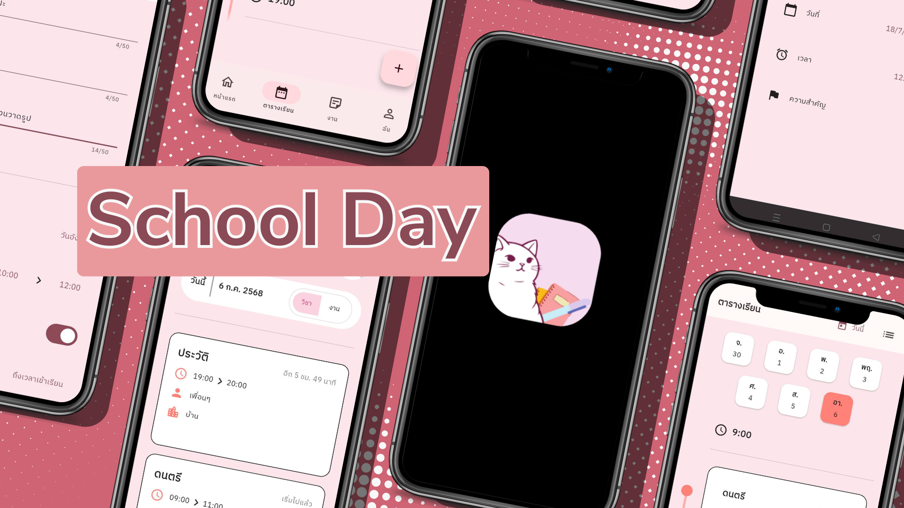

# School Day
Under the project **"Development of the School Day Application for Class Schedule and Task Management Using Artificial Intelligence Technology"** as part of the **"27th National Software Contest (NSC 2025)"**

**This research and activity is funded by the National Research Council of Thailand (NRCT) and National Science and Technology Development Agency (NSTDA)**

## Rationale
&nbsp;&nbsp;&nbsp;&nbsp;In the modern era, mobile phones and computers have become indispensable tools in everyday life. Their functions extend far beyond basic communication and now encompass information management and the organization of daily activities. For students in particular, managing increasingly complex class schedules and diverse academic tasks presents significant challenges. Therefore, an application that can systematically organize schedules and help manage time efficiently offers an effective solution for learners in today's digital age.

&nbsp;&nbsp;&nbsp;&nbsp;The rapid advancement of technology has enabled applications to provide increasingly convenient and accessible services. Moreover, the integration of artificial intelligence (AI) further enhances the user experience by facilitating data management, automating tasks, and minimizing the risk of missing important activities and deadlines.

&nbsp;&nbsp;&nbsp;&nbsp;In response to these needs, this project has been developed to create an application that empowers students to manage their class schedules and assignments in an organized and systematic manner. The system aims to reduce confusion in time management, streamline task tracking, and enhance flexibility in monitoring daily responsibilities. The primary goal is to deliver a user-friendly and intuitive tool that meets the demands of students living in a digital society where technology plays an integral role in daily life.

## Objectives
1.	To develop an application that integrates class scheduling and task tracking into a single, unified system.
2.	To support students in prioritizing their coursework and assignments more effectively and efficiently.

## Get the App
- [iOS](https://appdistribution.firebase.google.com/testerapps/1:648610348518:ios:5807e7f352eb30ec89aa27/releases/61h6nsmoafhpg?utm_source=firebase-console)
- [Android](https://github.com/cybloxboi/School-Day/releases)
- [Web](https://school-day-a1e87.web.app)

[Application Preview](https://youtube.com/shorts/vVLk0XQS6Kc?feature=share)

## Developers Details
- Mr.Sukonlanat Thawonfung [(@cybloxboi)](https://github.com/cybloxboi)
- Ms.Suphisara Siriamnat [(@Thong-muan)](https://github.com/Thong-muan)
- Mr.Wachirawit Buttakhot [(@viyawcrx)](https://github.com/viyawcrx)

Under the provision of Ms.Areerart Thani
From Amnatcharoen School

## License Agreement
&nbsp;&nbsp;&nbsp;&nbsp;This software is a work developed by Mr.Sukonlanat Thawonfung, Ms.Suphisara Siriamnat and Mr.Wachirawit Buttakhot from Amnatcharoen School under the provision of Ms.Areerart Thani under Development of School Day Application for Class Schedule and Task Management Using Artificial Intelligence Technology, which has been supported by National Science and Technology Development Agency (NSTDA), in order to encourage pupils and students to learn and practice their skills in developing software. Therefore, the intellectual property of this software shall belong to the developer and the developer gives NSTDA a permission to distribute this software as an "as is" and non-modified software for a temporary and non-exclusive use without remuneration to anyone for his or her own purpose or academic purpose, which are not commercial purposes. In this connection, NSTDA shall not be liable for any error, software efficiency and damages in connection with or arising out of the use of the software.
